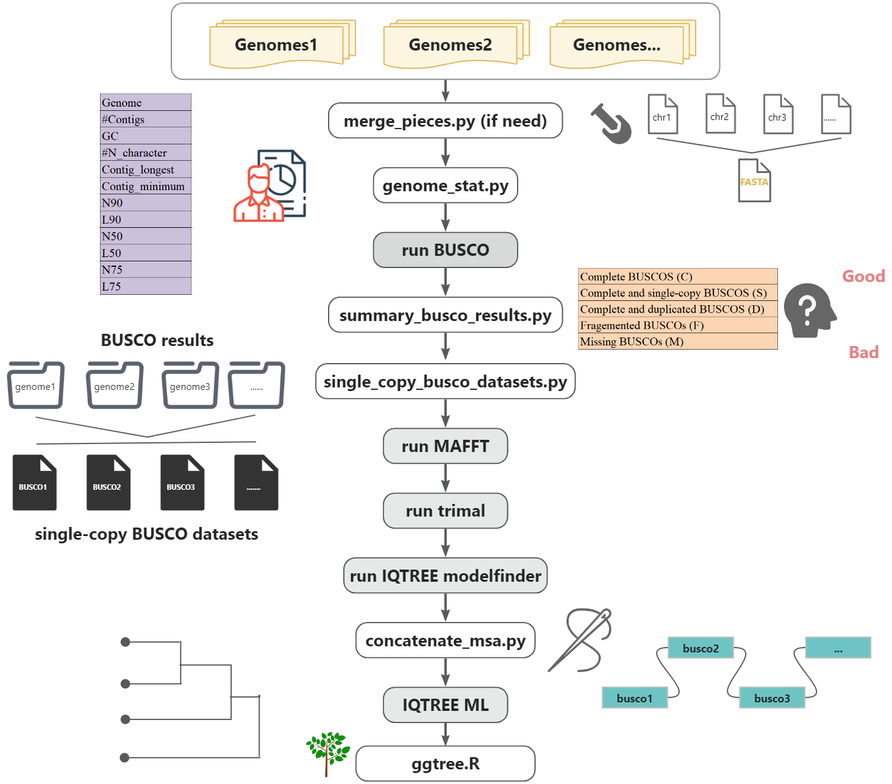

# 
A  workflow for conducting phylognetic analysis based on BUSCO orthologs (protein sequences **NOT** nucleotide sequences).



## Step1, if need
For some genomes, the contigs or chrosomes are different fasta files, script```merge_pieces.py``` were wrote to merge these genome pieces into one FASTA file.
```
cat file_lst | merge_assembly_pieces.py - -o output_directory
```
Format of the input file.

**Column1**: fingal genome prefix

**column2**: different pieces.
```
GCA_021398005.1 ./GCA_021398005.1/ncbi_dataset/data/GCA_021398005.1/GCA_021398005.fna
GCA_021436885.1 ./GCA_021436885.1/ncbi_dataset/data/GCA_021436885.1/chr1.fna
...
```
## Step2: Obtaining basic information of genomes
To obtain basic information of the genomes, how the quality of the assembly.

```
$ genome_stat.py -h
usage: genome_stat.py [-h] [-t <1>] <genome_lst.tsv>

genome_stat.py --stat basic information of genome assemblies.

date: 2024-07-28
bugs: yanpengch@qq.com
usage:
    ls 00_genomes/*.fna | genome_stat.py -t 4 - > genome.statistics.tsv
    find 00_genomes -name "*.fna" -type f | genome_stat.py -t 4 - > genome.statistics.tsv

positional arguments:
  <genome_lst.tsv>      Path to the file containing genome paths or use '-' for standard input

options:
  -h, --help            show this help message and exit
  -t <1>, --threads <1>
                        Number of threads to use. Default 1
```
**Output**
```
Genome  #Contigs        GC      #N_character    Contig_longest  Contig_minimum  N90     L90     N50     L50     N75     L75
00_genomes/GCA_000002515.1.fna  6       0.3642047151347448      44      2602197 1062590 1320834 5       1753957 3       1715506 4
00_genomes/GCA_000002545.2.fna  13      0.36257972642186453     300     1455689 491328  558804  11      1100349 5       927101  8
00_genomes/GCA_000002525.1.fna  6       0.45160903650109024     1171    4224103 2303261 2303261 6       3633272 3       3066374 5
00_genomes/GCA_000002945.2.fna  4       0.3215030226710216      402     5579133 19431   2452883 3       4539804 2       4539804 2
...
```
## Step3: run BUSCO analysis
Use BUSCO to evaluate genome completeness and identify BUSCO genes
```
cat genome_accession.list | while read a;do echo "busco -i ${genome_dir}/${genome_abbrev}.fna \
-o ${genome_abbrev}_busco \
--out_path ${output_dir} \
--offline --cpu 8 \
--mode geno \
-l ${lineage} &> ${output_dir}/${genome_abbrev}_busco.log";done  > run_busco.sh

# parallel 
nohup ParaFly -c run_busco.sh -failed_cmds run_busco.sh.failed &
```

## Step 4: summary BUSCO results
When we are carrying out a big project including thousands of genomes, we should summarize all BUSCO results and further to remove bad assemblies. 
For this purpose, I wrote ``summary_busco_results.py``.
```
find . -name 'short_summary.specific*txt' | summary_BUSCO_results.py - | sed 's/genome_label/Assembly/;s/.fna//' > busco_statistics.tsv
```

**Results** as shown below:
```
Assembly	C	S	D	F	M	Complete BUSCOS (C)	Complete and single-copy BUSCOs (S)	Complete and duplicated BUSCOs (D)	Fragemented BUSCOs (F)	Missing BUSCOs (M)   Total BUSCO groups searched
GCA_013390195.1	97.8%	97.5%	0.3%	0.2%	2.0%	1669	1664	5	3	34	1706
GCA_003568745.1	97.0%	96.3%	0.7%	0.8%	2.2%	1655	1643	12	13	38	1706
GCA_014705165.1	97.6%	97.1%	0.5%	0.4%	2.0%	1665	1656	9	6	35	1706
```

## step 5: construct single-copy BUSCO datasets
```
ls genome_labels.list | awk '{print $1"\t../01_busco/"$1"_busco/run_fungi_odb10/full_table.tsv"}' | single_copy_busco_datasets.py -d ~/database/busco/fungi_odb10/links_to_ODB10.txt -m class_matrix.tsv -c 50 -o 02_single_copy_busco_datasets -t 8 -
# or
single_copy_busco_datasets.py -d ~/database/busco/fungi_odb10/links_to_ODB10.txt -m class_matrix.tsv -c 50 -o 02_single_copy_busco_datasets -t 8 label_full_table.path.list
```
input file:
```
GCA_902806535.1    ./GCA_902806535.1_HR_busco/run_ascomycota_odb10/full_table.tsv
GCA_002246955.1    ./GCA_002246955.1_ASM224695v1_busco/run_ascomycota_odb10/full_table.tsv
...
```

## step 6: run MAFFT
```
mkdir 03_mafft
ls 02_single_copy_busco_datasets/*faa | sed "s/02_single_copy_busco_datasets\///"| while read a;do echo "mafft --thread 4 --auto 02_single_copy_busco_datasets/${a} > 03_mafft/${a%.faa}.mafft.faa 2> /dev/null";done > run_mafft.sh
nohup ParaFly -c run_mafft.sh -CPU 8 --failed_cmds run_mafft.sh.failed &
```
## step 7: run trimal
```
mkdir 04_trimal
ls 03_mafft/ | sed 's/.mafft.faa//' | xargs -I {} trimal -in 03_mafft/{}.mafft.faa -out 04_trimal/{}.mafft.trimal.faa -gappyout
```
## step 8: IQTREE modelfinder
```
mkdir 05_modelfinder
ls 04_trimal/*faa | msa_length.py - | awk '$2>=300 {print $1}' | sed "s/.mafft.trimal.faa//;s/04_trimal\///" | while read a;do echo "\
iqtree -s 04_trimal/${a}.mafft.trimal.faa \
--seqtype AA \
-T 4 \
--prefix 05_modelfinder/${a} \
-m TESTONLY \
--msub nuclear \
--mset mrbayes" > run_modelfinder.sh
nohup ParaFly -c run_modelfinder.sh -CPU 8 --failed_cmds run_modelfinder.sh.failed &
```

## step 9: Concatenate msas
```
mkdir 06_iqtree
ls 04_trimal/*faa | msa_length.py - | awk '$2>=300 {print $1}' | concatenate_msa.py -o 06_iqtree/concatenated.faa -
```
## step 10: IQTREE ML
```
mkdir 06_iqtree
model=$(grep "Best-fit model: .* chosen according to BIC" 05_modelfinder/*log| sed 's/.*Best-fit model://;s/ chosen according to BIC//' | awk '{a[$0]+=1}END {for (i in a) print i, a[i]}' | sort -k 2 -nr)
nohup iqtree -s 06_iqtree/concatenated.faa \
--seqtype AA \
-o ${outgroup} \
--prefix 06_iqtree/iqtree.ml \
--mem 150G \
-T AUTO --threads-max 16 \
--ninit 50 \
--ufboot 1000 \
--abayes \
-m WAG+I+G4 &
```

